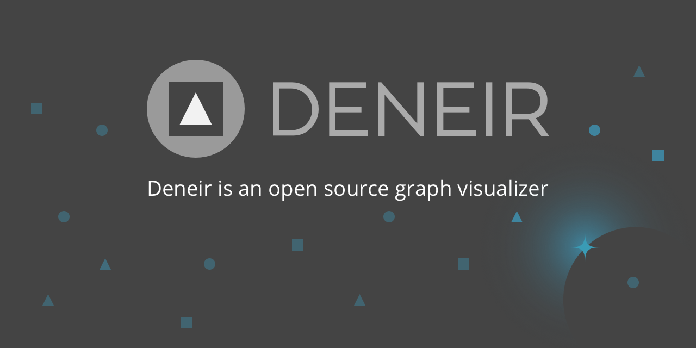
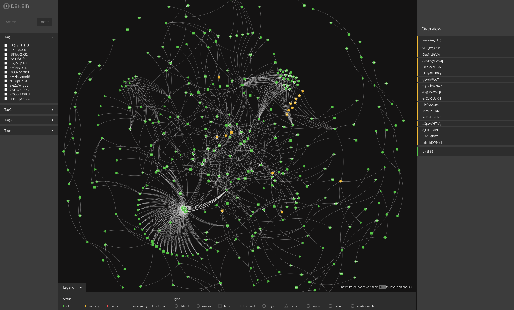
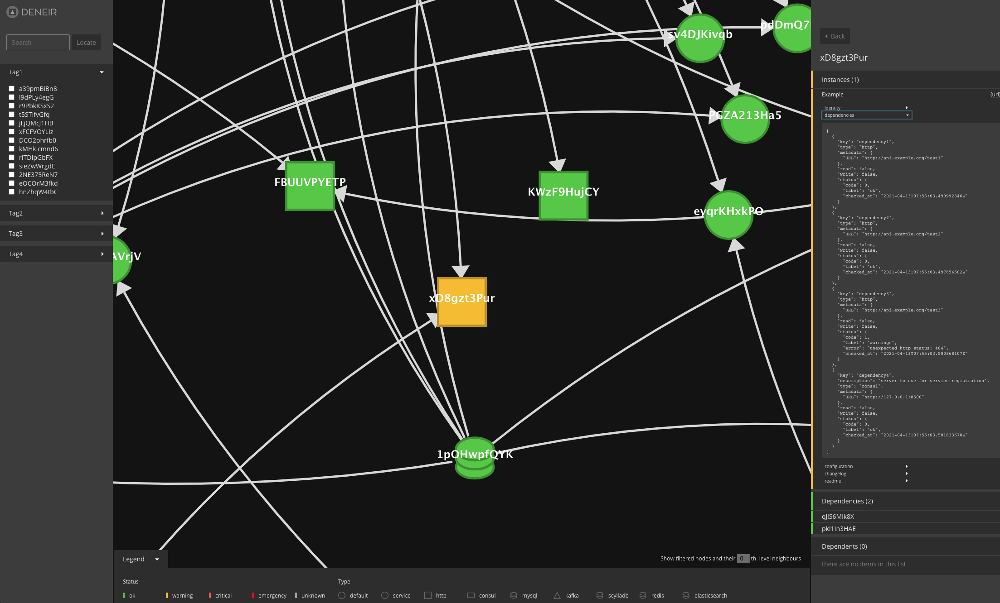
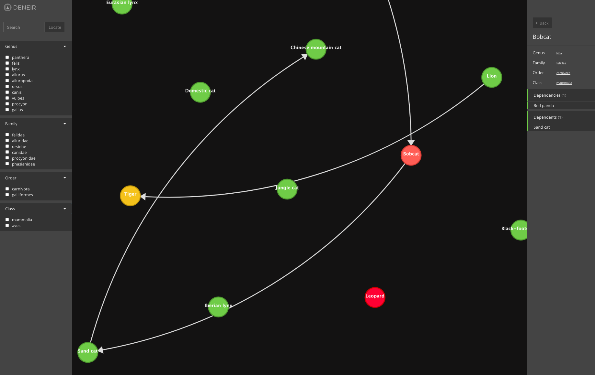
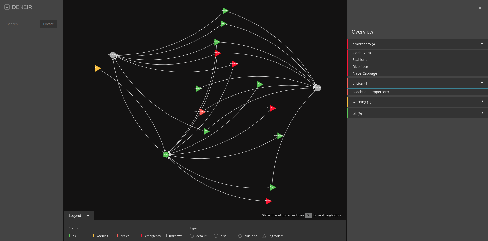

Deneir is an open source graph visualization tool. Graph visualization is a way of representing data modeled in terms of nodes and edges (objects and relationships).

Deneir can be used to represent complex graphs with features like search or custom node classification.

Deneir's datasource could be an [API or a file](#API-Specification)

This tool has been built at Synthesio to get the big picture on our microservice architecture and also have a real time dependancies status.
In a fast-growing environment where microservices and interconnections between them grow exponentially, it helps people to vizualize impacts when a microservice changes, or for monitoring purposes.

## Features

- Beautiful KISS UI
- Custom node classification
- Search and Filters
- Show external information on a node

## Use cases & Demos

All demos: [here](https://deneir.github.io/)

### Microservice dependencies

Deneir can be used to monitor a microservices plaftorm, to visualize services status and their dependencies status (internal or external).

At Synthesio, each microservice registers in a global Consul instance. Doing so, a microservice also exports urls to its dependencies status, configuration, changelog, tags, metrics link and also documentation.
A golang daemon internally named `frag` connects to `consul` and for reading the url list. `frag` asynchronously fetch the content of all these urls and consolidate all routes into a  json tree pollable by `Deneir`.
Then you get an almost live map of Synthesio's microservice infrastructure. Which was the first use case for `Deneir`.

[=> Live Demo <=](https://deneir.github.io/microservice/)
[Demo files](https://github.com/deneir/deneir/tree/main/demos/microservices/)

### Cats

Using tags for taxonomy allows you to list all cats for a specific family or visualize family inheritance.

[=> Live Demo <=](https://deneir.github.io/cats/)
[Demo files](https://github.com/deneir/deneir/tree/main/demos/cats/)

### Cooking recipes

[=> Live Demo <=](https://deneir.github.io/food/)
[Demo files](https://github.com/deneir/deneir/tree/main/demos/food/)

### Add your use case here

Feel free to submit a PR with your use case and feedback.

## Getting started

We provide a docker-compose file to build and test deneir:
* `docker-compose up -d --build`
* A demo config is created by default but you can create a config.json file with your needs (cf "Advanced configuration")
* Open in your browser [http://localhost:5000](http://localhost:5000)

## Advanced configuration

See [Configuration](docs/configuration.md)

## API Specification

See [API](docs/api.md) and [Openapi file](docs/openapi.yaml)

## Building and contributing

* `npm install && npm run build`
* follow the steps described in "Getting started", using the contents of the `build` folder

## Future

We intend to get implement a few features such as:
- graph persistent storage
- differential states
- historize states based on keyframe+diffs (like in video formats)
- compress storage
- allow events replay (if you have an incident you can replay at the speed you like what happened to see where an incident started for instance)
- incident impact simulator (if I break this node of the graph what can I expect)
